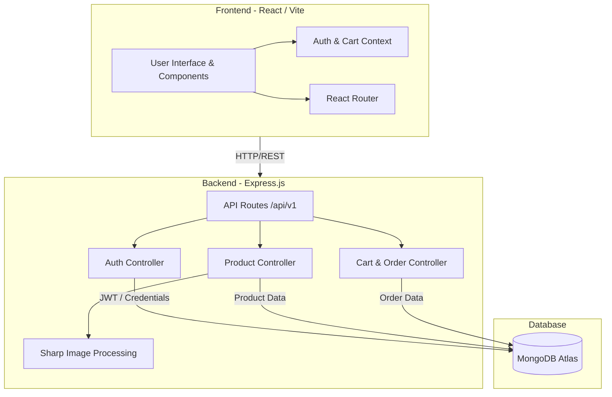

<div align="center">
  
  
  <br />
  
  <h1>🚀 DevGear Store</h1>
  
  <p><strong>A Neo-Brutalist E-Commerce Marketplace Built for Developers</strong></p>
  
  <p>
    
    
    
    
    
    
  </p>
</div>

---

## ⚡ Overview

**DevGear Store** is a full-stack, production-ready e-commerce platform designed from the ground up with a bold **Neo-Brutalist** aesthetic. It focuses on high-contrast UI, loud typography, and unapologetic borders to create a memorable shopping experience tailored specifically for software engineers, designers, and tech enthusiasts.

It features complete cart flows, advanced category filtering, user authentication, responsive imagery (`webp`/`jpg` variants via `sharp`), and a comprehensive Admin Dashboard.

## 🛠 Tech Stack

### Frontend
- **Framework**: React 18
- **Build Tool**: Vite
- **Styling**: Tailwind CSS v4 (Custom Neo-brutalist Design Tokens)
- **Routing**: React Router v6
- **Icons**: Lucide React
- **State Management**: Context API

### Backend
- **Runtime**: Node.js
- **Framework**: Express.js
- **Database**: MongoDB (Mongoose ORM)
- **Authentication**: JWT (JSON Web Tokens)
- **Image Processing**: Multer + Sharp (Auto-generates optimized image sizes)

---

## 🏛 Architecture Diagram



---

## 🌟 Key Features

- 🛒 **Full E-Commerce Flow**: Browse, filter, add to cart, and checkout seamlessly.
- 🎨 **Neo-Brutalist Design System**: High-contrast, accessibility-friendly, bold visuals.
- 🔐 **Role-Based Authentication**: Secure JWT-based login for standard users and Admins.
- 🛠 **Admin Dashboard**: Create products, manage orders, and upload media directly from the UI.
- 🖼 **Automated Image Optimization**: Uploaded images are automatically converted to optimized `webp` and scaled to multiple sizes (400w, 800w, 1200w).
- 📱 **Mobile-First & Responsive**: Scales perfectly from desktop to mobile screens.
- ⚡ **Lightning Fast Data Fetching**: Utilizes optimized indexing in MongoDB and robust REST API patterns.

---

## 🚀 Getting Started

### Prerequisites
- Node.js (v18 or higher)
- MongoDB (Local or Atlas URL)

### 1. Clone & Install
```bash
# Install server dependencies
cd server
npm install

# Install client dependencies
cd ../client
npm install
```

### 2. Environment Variables
Create a `.env` file in the `/server` directory:
```env
PORT=5000
MONGODB_URI=your_mongodb_connection_string
JWT_ACCESS_SECRET=your_jwt_access_secret
JWT_REFRESH_SECRET=your_jwt_refresh_secret
CLIENT_ORIGIN=http://localhost:5173
```

### 3. Run the App
**Run the backend (from `/server`):**
```bash
npm run dev
```

**Run the frontend (from `/client`):**
```bash
npm run dev
```

---

## 🛡 Admin Access

By default, new users are registered as standard customers. To access the `http://localhost:5173/admin` dashboard, you must promote an account to Admin.

A utility script is included to quickly promote a user:
```bash
cd server
node makeAdmin.js <your-registered-email@example.com>
```

---

<div align="center">
  <p>Built with 🖤 for the developer community.</p>
</div>
